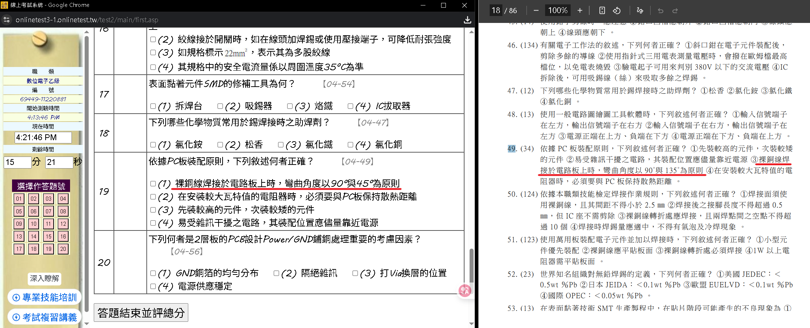
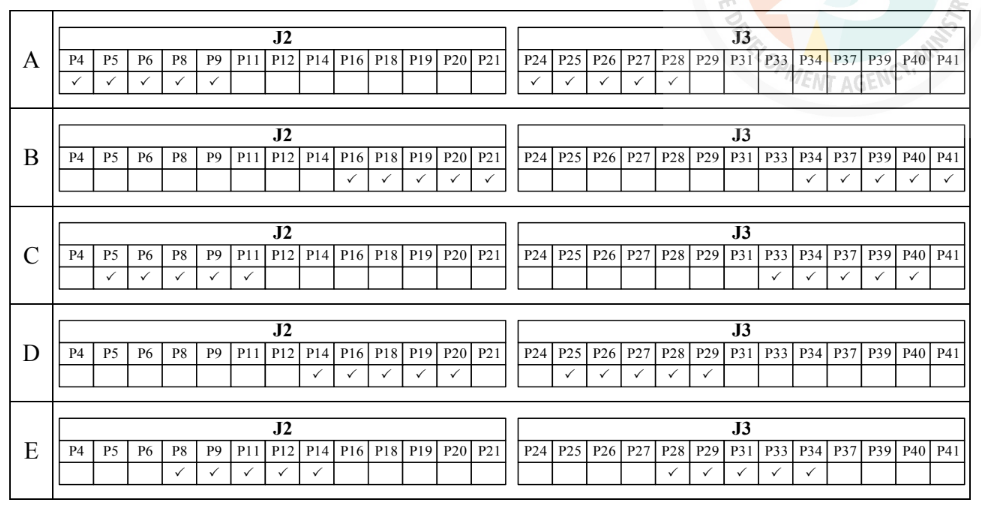
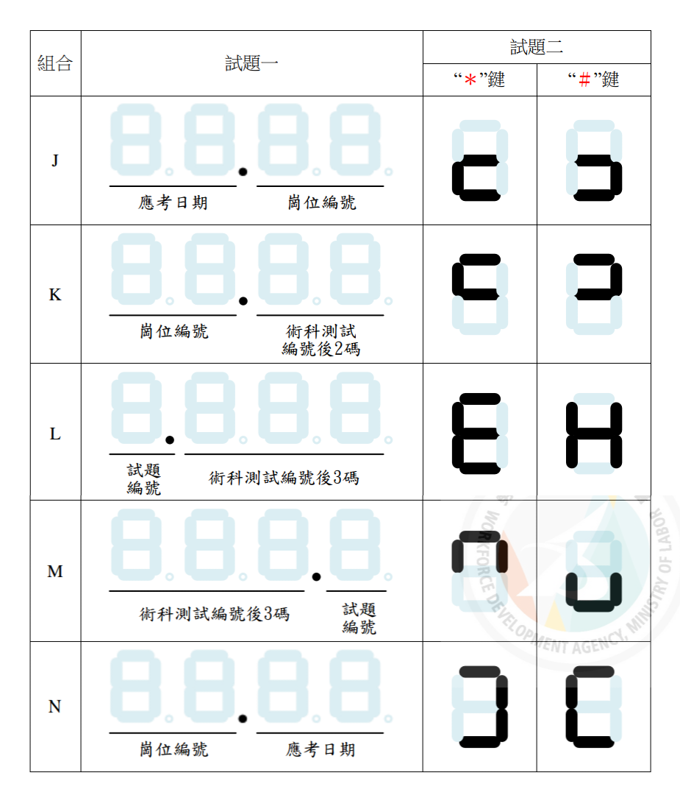
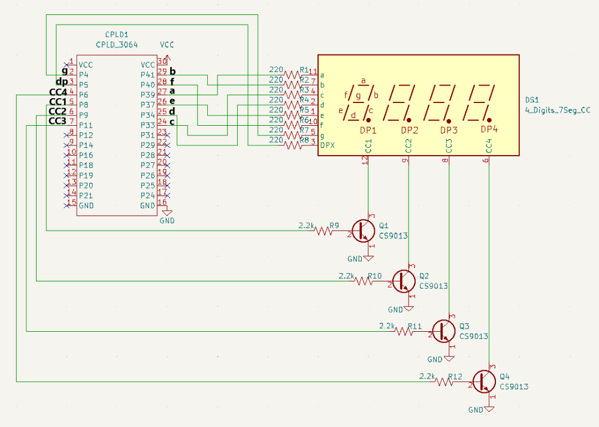
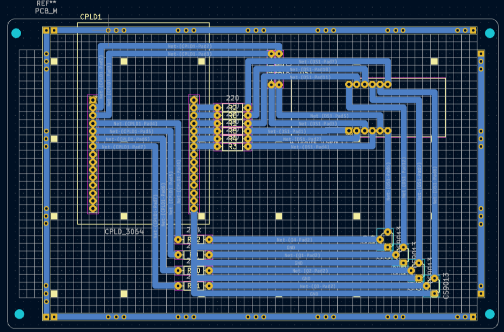
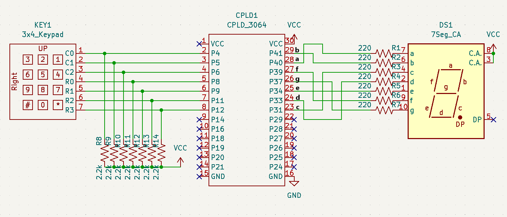
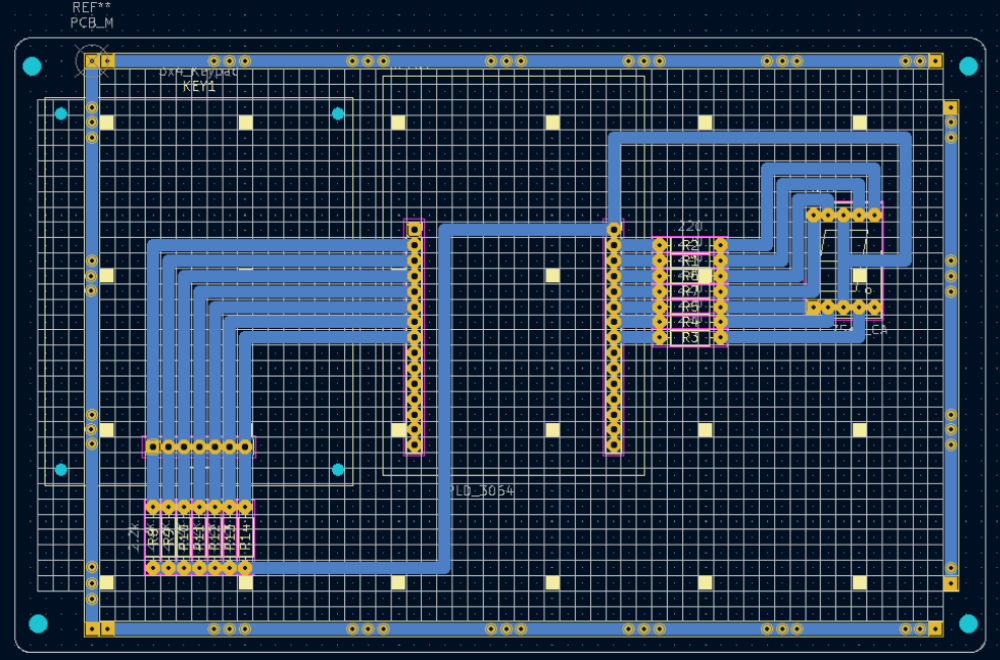

技能檢定參考資料：<https://owinform.wdasec.gov.tw/>

***

## 學科

<details class="dt" open>
<summary>資源</summary>

- [學科題庫](https://owinform.wdasec.gov.tw/owInform/DLowFile/117002A13.pdf?940)
- ~~[乙級學科題庫線上測驗](https://onlinetest3-1.onlinetest.tw/bestcontent.asp?examid=t11700)~~ (有未修復的題目錯誤)
- [手機 技能檢定題庫 APP](https://play.google.com/store/apps/details?id=com.SkillExamination&hl=zh_TW)

</details>

<details class="dt" close>
<summary>線上測驗題庫 的題目錯誤</summary>

下列是 [乙級學科題庫線上測驗](https://onlinetest3-1.onlinetest.tw/bestcontent.asp?examid=t11700) 的其中一個題目錯誤<br>



(這題庫另外還有一些圖片無法顯示的問題)

</details>

<hr>

## 術科 - 測試須知

### 🔹 測試資料

<details class="dt" open>
<summary>資源</summary>

- [術科簡章](https://owinform.wdasec.gov.tw/owInform/DLowFile/117002B13.pdf?13)
- [術科資料 (Library & 燒錄檔)](https://owinform.wdasec.gov.tw/owInform/DLowFile/117002B14.7z?13)
- [KiCad](https://www.kicad.org/)
- [Quartus](https://www.intel.com.tw/content/www/tw/zh/software-kit/711791/intel-quartus-ii-web-edition-design-software-version-13-0sp1-for-windows.html)

</details>

### 🔹 題目

<details class="dt" open>
<summary>接腳</summary>

<font color="#ff7000">未使用的規定接腳 每隻扣10分</font>

打勾的是 CPLD 必須使用的接腳<br>
沒有打勾的可用可不用



</details>

<details class="dt" open>
<summary>顯示內容</summary>

<font color="#ff7000">未使用的規定接腳 每隻扣10分</font>



</details>

### 🔹 規範

<details class="dt" open>
<summary>KiCad 圖框</summary>

<font color="#ff7000">未完成每項扣10分</font>

Title: `[術科測試編號(8碼)]-[崗位編號]`<br>
Date: `測試日期`

</details>

<details class="dt" open>
<summary>資料夾</summary>

<font color="#ff7000">未完成每項扣10分</font>

要求在 `D:\` 放置兩資料夾

- `[崗位編號]_CPLD` : Quartus 專案
- `[崗位編號]_Layout` : KiCad 專案

```text
以下是建議的目錄
(假設工作崗位為 01)

D:
├── 01_CPLD
│   └── cpld      : Quartus 專案
└── 01_Layout
    ├── layout    : KiCad 專案
    ├── sch_f.pdf : 正面佈線圖
    └── sch_b.pdf : 背面佈線圖
```

專案名稱不能以 **數字** 開頭<br>
所以完成後再將整個專案複製進資料夾

</details>

### 🔹 流程 & 時間分配

<details class="dt" open>
<summary>建議的流程</summary>

**測試時間為 6 小時**

以下是建議的實作流程

|  | 內容 | 描述 | 建議花費時間 |
|---|---|---|:-:|
| 一 | 檢查材料 |  | |
| 二 | KiCad | 1. 原理圖<br>2. 佈線圖<br>3. 列印 | < 1 hr |
| 三 | 焊接 | 1. 子板<br>2. 母板 | < 2.5 hr |
| 四 | Quartus | 1. verilog<br>2. 腳位配置<br>3. 燒入 | < 0.5 hr |
| 五 | 評分 | | |

</details>

### 🔹 其他補充 & 建議

<details class="dt" close>
<summary>KiCad 當機</summary>

KiCad 是不支援 **微軟輸入法** 的<br>
如果使用 微軟輸入法 點了某個輸入框<br>
有機率造成 KiCad 當機

當機時 `Ctrl + Shift + Esc` 開啟 **工作管理員**<br>
找到 KiCad，點擊 結束工作 解決

**改用輸入法可以徹底解決這個問題**

</details>

<details class="dt" close>
<summary>佈線建議</summary>

#### 避免跳線

雖然考場提供單芯線以供跳線<br>
但跳線會延長非常多的焊接時間<br>
建議 **所有佈線皆在背面完成**

#### 避免轉折與繞線

為了減短焊接時間<br>
建議 **在原理圖修改接腳**，<br>
使佈線圖盡量避免轉折與繞線

</details>

<details class="dt" close>
<summary>試場提供兩張紙</summary>

試場提供了兩張紙用於印刷 KiCad 輸出的 PDF<br>
建議 **雙面印刷**<br>
印刷錯誤還能有一次機會

</details>

<details class="dt" close>
<summary>難用的錫</summary>

材料包提供的錫可能非常難用<br>
如果有這種狀況<br>
建議直接去供應材料處索取

</details>

***

## 術科 - 試題

### 🔸 試題一、四位數顯示

<details class="dt" open>
<summary>Layout</summary>

```text
如果你打算使用以下的連接方式
建議直接背，七段顯示器接腳 (由上而下)

b f a e d c
g dp
```

#### 參考圖

若與抽到的題目接腳不同 則依照題目進行上下移




</details>

<details class="dt" open>
<summary>CPLD</summary>

共陰極七段顯示:<br>
對於 `output reg[6:0] seg`<br>

- 1 = ON
- 0 = OFF

依照題目修改 七段顯示器 的顯示內容

```verilog
module cpld(
    input clk,
    output reg[3:0] scan
    output reg[7:0] seg
);

reg[11:0] div;
always @(posedge clk) begin
    div <= div + 1'b1;
end

always @(posedge div[11]) begin
    case(scan)
        4'b0001: begin scan <= 4'b0010; seg <= 8'b11111111; end // 8
        4'b0010: begin scan <= 4'b0100; seg <= 8'b11111111; end // 8
        4'b0100: begin scan <= 4'b1000; seg <= 8'b11111111; end // 8
        default: begin scan <= 4'b0001; seg <= 8'b11111111; end // 8
    endcase
end

endmodule
```

</details>

### 🔸 試題二、鍵盤輸入顯示

<details class="dt" open>
<summary>Layout</summary>

```text
如果你打算使用以下的連接方式
建議直接背，七段顯示器接腳 (由上而下)

b a f g e d c
```

#### 參考圖

若與抽到的題目接腳不同 則依照題目進行上下移




</details>

<details class="dt" open>
<summary>CPLD</summary>

共陽極七段顯示:<br>
對於 `output reg[6:0] seg`<br>

- 0 = ON
- 1 = OFF

依照題目修改 `＊鍵` 與 `＃鍵` 的顯示內容

```verilog
module cpld(
    input clk,
    input [2:0] receive, 
    output reg[3:0] scan,
    output reg[6:0] seg
);

always @(posedge clk) begin
    case(scan)
        4'b1110: begin
                scan <= 4'b1101;
                if     (receive == 3'b110) seg <= 7'b1001111; // 1
                else if(receive == 3'b101) seg <= 7'b0010010; // 2
                else if(receive == 3'b011) seg <= 7'b0000110; // 3
        end
            
        4'b1101: begin
                scan <= 4'b1011;
                if     (receive == 3'b110) seg <= 7'b1001100; // 4
                else if(receive == 3'b101) seg <= 7'b0100100; // 5
                else if(receive == 3'b011) seg <= 7'b0100000; // 6
        end
            
        4'b1011: begin
                scan <= 4'b0111;
                if     (receive == 3'b110) seg <= 7'b0001101; // 7
                else if(receive == 3'b101) seg <= 7'b0000000; // 8
                else if(receive == 3'b011) seg <= 7'b0001100; // 9
        end
            
        default: begin
                scan <= 4'b1110;
                if     (receive == 3'b110) seg <= 7'b1111110; // -
                else if(receive == 3'b101) seg <= 7'b0000001; // 0
                else if(receive == 3'b011) seg <= 7'b1111110; // -
        end
    endcase
end

endmodule
```

</details>
