 

歷屆考題

- [110~113 模擬考 電機電子群 專一](/icrack41-blog/assets/notes/professional_subjects_1/電機電子群_專一.zip)
- ~~統測 電機電子群 專一~~

***

工廠安全 & 衛生

## 工廠安全 & 衛生

### 🔸 火災

#### 分類

| 類別 | 描述 |
|---|---|
| 甲類 (A) | 一般火災 |
| 乙類 (B) | 油類火災 |
| 丙類 (C) | 電器火災 |
| 丁類 (D) | 金屬火災 |

#### 滅火器

| | 水 | 泡沫 | 二氧化碳 | 乾粉 |
|---|:-:|:-:|:-:|:-:|
| 甲類 (A) | ✅ | ✅ | | ✅ |
| 乙類 (B) | | ✅ | ✅ | ✅ |
| 丙類 (C) | | | ✅ | ✅ |
| 丁類 (D) | | | | |

🔹 電器類火災不可使用泡沫滅火器，但如切斷電源，則視同 A、B 類火災

[資料來源](http://localhost:4321/icrack41-blog/blog/professional_subjects_1)

#### 滅火器步驟

| 步驟 | 描述 |
|---|---|
| 拉 | 旋轉並拉開安全插梢 |
| 瞄 | 瞄準火源底部 |
| 壓 | 壓下手壓柄 |
| 掃 | 左右掃射火源 |

### 🔸 燒傷

#### 急救步驟

| 步驟 | 描述 |
|---|---|
| 沖 | 冷水沖 20~30 min |
| 脫 | 拖去衣物 |
| 泡 | 浸泡冷水 10~30 min |
| 蓋 | 紗布覆蓋傷口 |
| 送 | 送醫 |

#### 灼傷分級

| 級數 | 受傷層 | 特徵 |
|---|---|---|
| 一度灼傷 | 表皮層 | 皮膚紅腫、疼痛 |
| 二度灼傷 | 真皮層 | 產生水泡 |
| 三度灼傷 | 皮下組織層 | 皮膚呈焦黑色 或 蒼白色 |
| 四度灼傷 | 肌肉和骨骼 | 焦黑 且 碳化(焦炭狀) |

### 🔸 心肺復甦 CPR

| 步驟 | 描述 |
|---|---|
| 叫 | 叫患者，檢查意識 |
| 叫 | 叫救護車 |
| C | 胸部按摩 (每分鐘 100 次，深度 5 cm) |
| A | 暢通呼吸道 |
| B | 人工呼吸 |
| D | 使用 AED |

***

電子學

## 電子學

### 🔸 電子學發展史

真空管 → 電晶體 → 積體電路 → 微電腦

### 🔸 積體電路分類

| | 邏輯閘數 | 元件數 |
|---|---|---|
| SSI | $<12$ | $<10^{2}$ |
| MSI | $12 \sim 10^{2}$ | $10^{2} \sim 10^{3}$ |
| LSI | $10^{2} \sim 10^{3}$ | $10^{3} \sim 10^{4}$ |
| VLSI | $10^{3} \sim 10^{4}$ | $10^{4} \sim 10^{5}$ |
| ULSI | $>10^{4}$ | $>10^{5}$ |

### 🔸 波形

#### 弦波

$v(t) = V_{m}sin(2 \pi ft \pm \theta)$

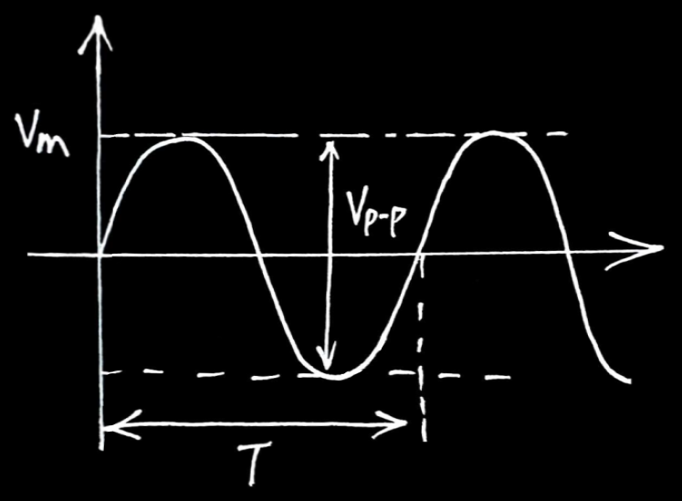

🔹 所有波形皆可以用弦波組成 ([wiki-傅立葉轉換](https://zh.wikipedia.org/zh-tw/%E5%82%85%E9%87%8C%E5%8F%B6%E5%8F%98%E6%8D%A2))

#### 工作週期 D%

$\underset{\color{Teal} Duty Cycle}{D\%} = \frac{T_{H}}{T_{H}+T_{L}}$

#### 有效值、平均值

| | $\underset{\color{Teal} \text{有效值}}{V_{rms}}$ | $\underset{\color{Teal} \text{平均值}}{V_{av}}$ | $\underset{\color{Teal} \text{波峰因數}}{CF}$ | $\underset{\color{Teal} \text{波形因數}}{FF}$ |
|---|:-:|:-:|:-:|:-:|
| 方波 | $V_{m}$ | $V_{m}$ | 1 | 1 |
| 正弦波 | $\underset{\color{Teal} 0.707 V_{m}}{\frac{1}{\sqrt{2}} V_{m}}$ | $\underset{\color{Teal} 0.636 V_{m}}{\frac{2}{\pi} V_{m}}$ | $\underset{\color{Teal} 1.414}{\sqrt{2}}$ | $\underset{\color{Teal} 1.11}{\frac{\pi}{2\sqrt{2}}}$ |
| 三角波 | $\underset{\color{Teal} 0.577 V_{m}}{\frac{1}{\sqrt{3}} V_{m}}$ | $\underset{\color{Teal} 0.5 V_{m}}{\frac{1}{2} V_{m}}$ | $\underset{\color{Teal} 1.732}{\sqrt{3}}$ | $\underset{\color{Teal} 1.154}{\frac{2}{\sqrt{3}}}$ |

$\underset{\color{Teal} Crest Factor}{CF} = \frac{V_{m}}{V_{rms}}$  
$\underset{\color{Teal} Form Factor}{FF} = \frac{V_{rms}}{V_{av}}$

### 🔸 原子

| | 導體 | 半導體 | 絕緣體 |
|:-:|:-:|:-:|:-:|
| $\underset{\color{Teal} \text{最外層軌道的電子}}{\text{價電子數}}$ | $<4$ | $4$ | $>4$ |
| $\text{能隙}$ | $0eV$ | $1eV$ | $9eV$ |
| $\text{電阻溫度係數}$ | $+$ | $-$ | $-$ |

$\underset{\color{Teal} \text{電子伏特(能量)}}{1 eV} = 1.6 \times 10^{-19} J$

$\text{軌道上電子數} = \underset{\color{Teal} \text{n:\:第n層軌道}}{2n^{2}}$

### 🔸 半導體

| | N 型半導體 | P 型半導體 |
|---|:-:|:-:|
| 參雜 | 5價 | 3價 |
| 元素 | $\underset{\color{Teal} P}{\text{磷}}\text{、}\underset{\color{Teal} As}{\text{砷}}\text{、}\underset{\color{Teal} Sb}{\text{銻}}$ | $\underset{\color{Teal} B}{\text{硼}}\text{、}\underset{\color{Teal} Al}{\text{鋁}}\text{、}\underset{\color{Teal} Ga}{\text{鎵}}\text{、}\underset{\color{Teal} In}{\text{銦}}$ |
| 別稱 | $\underset{\color{Teal} \text{給別人電子}}{\text{施體}}$ | $\underset{\color{Teal} \text{接受別人的電子}}{\text{受體}}$ |
| 離子 | $\underset{\color{Teal} \text{失去一個電子: 正}}{+}$ | $\underset{\color{Teal} \text{接受一個電子: 負}}{-}$ |
| 電性 | 電中性 | 電中性 |
| 多數載子 | 電子 | 電洞 |

本質半導體: $n_{i} = n = p$ 
雜質半導體: $\underset{\color{Teal} \text{本質濃度}}{n_{i}^{2}} = \underset{\color{Teal} \text{電子濃度}}{n} \times \underset{\color{Teal} \text{電洞濃度}}{p}$

#### 載子移動方式

$\underset{\color{Teal} Diffusion}{\text{擴散}}$: 載子濃度不均引起 
$\underset{\color{Teal} Drift}{\;\; \text{飄移}}$: 外加電壓引起

| | 擴散電流 | 飄移電流 |
|---|:-:|:-:|
| 導體 | | ✅ |
| 半導體 | ✅ | ✅ |

### 🔸 二極體

#### 材質

| | $\underset{\color{Teal} Ge}{\text{鍺}}$ | $\underset{\color{Teal} Si}{\text{矽}}$ | $\underset{\color{Teal} GaAs}{\text{砷化鎵}}$ |
|---|:-:|:-:|:-:|
| $\text{能隙}$ | $0.66eV$ | $1.1eV$ | $1.42eV$ |
| $\underset{\color{Teal} V_{D}}{\text{障壁電壓}}$ | $0.2V \sim 0.3V$ | $0.6V \sim 0.7V$ | $1.1V \sim 1.2V$ |

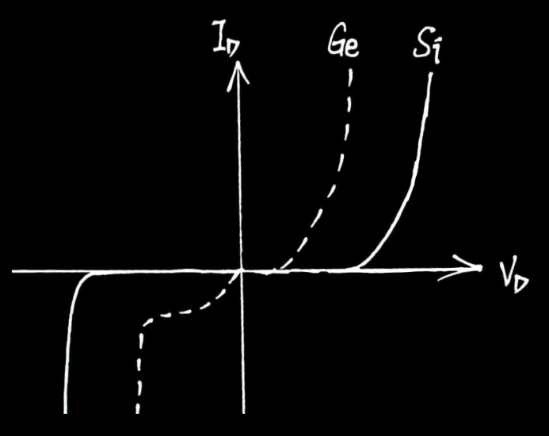

#### 外加偏壓

順向偏壓⬆ => 障壁電壓⬇、空乏區寬度⬇

逆向偏壓⬆ => 障壁電壓⬆、空乏區寬度⬆

$$
\begin{aligned}
\underset{\color{Teal} \text{順向導通電流}}{I_{d}} &= \underset{\color{Teal} \text{逆向飽和電流(漏電流)}}{I_{s}} \times (e^{\frac{V_{D}}{\eta V_{T}}}-1) \\
&= \; \underset{\color{Teal} \text{當} \;  V_{D}>>\eta V_{T}}{I_{s} \times e^{\frac{V_{D}}{\eta V_{T}}}}
\end{aligned}
$$

#### 參雜濃度

參雜濃度⬆ => 障壁電壓⬆、空乏區寬度⬇

#### 溫度效應

| | 描述 | 公式 |
|---|---|---|
| $\underset{\color{Teal} \text{切入電壓}}{V_{on}}$ | 溫度上升 1℃，下降 $\underset{\color{Teal} \text{鍺}}{1mV} / \underset{\color{Teal} \text{矽}}{2.5mV}$ | $V_{on2} = V_{on1} - \underset{\color{Teal} \text{or 1mV}}{2.5mV} \times \Delta T$ |
| $\underset{\color{Teal} \text{漏電流}}{I_{s}}$ | 溫度上升 10℃，增加 $1$ 倍 | $I_{s2} = I_{s1} \times 2^{\frac{\Delta T}{10}}$ |

#### 電阻效應

$\underset{\color{Teal} \text{靜態電阻} \; R_{DC}}{R_{D}} = \frac{V_{D}}{I_{D}}$ 
$\underset{\color{Teal} \text{動態電阻} \; r_{ac}}{r_{d}} = \frac{\eta V_{T}}{I_{D}}$ 

$\;\; K = ^\circ\text{C} + 273$ 
$\underset{\color{Teal} \text{熱電壓}}{V_{T}} = \frac{K}{11600}$ 

#### 電容效應

| 偏壓 | 電容 |
|---|---|
| 順偏 | $I_{D} \uparrow \;\; \Rightarrow \underset{\color{Teal} \text{擴散電容}}{C_{D} \uparrow}$ |
| 逆偏 | $\text{逆偏壓} \uparrow \;\; \Rightarrow \underset{\color{Teal} \text{過度電容}}{C_{T} \downarrow}$ |

### 🔸 稽納二極體

| 偏壓 | 稽納二極體 |
|---|---|
| 順偏 | $\text{視同一般二極體}$ |
| 逆偏 | $\text{逆偏壓} > \underset{\color{Teal} \text{稽納電壓}}{V_{Z}} \Rightarrow \underset{\color{Teal} \text{兩端電壓維持在}V_{Z}}{\text{稽納二極體崩潰}}$ |

| | 稽納崩潰 | 累增崩潰 |
|---|:-:|:-:|
| 崩潰原因 | 穿隧效應 | 撞擊游離 |
| 電壓 | $<6V$ | $>6V$ |
| 溫度係數 | $-$ | $+$ |

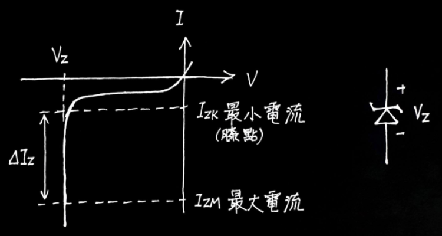

### 🔸 整流電路

| | 半波整流 | 中間抽頭 | 橋式整流 |
|---|:-:|:-:|:-:|
| 輸出波形 | 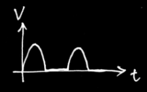 | 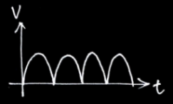 |  |
| 頻率 | $f$ | $2f$ | $2f$ |
| $PIV$ | $V_{m}$ | $2V_{m}$ | $V_{m}$ |
| $V_{dc}$ | $0.318V_{m}$ | $0.636V_{m}$ | $0.636V_{m}$ |
| $V_{rms}$ | $0.5V_{m}$ | $0.707V_{m}$ | $0.707V_{m}$ |
| $V_{r(rms)}$ | $0.385V_{m}$ | $0.308V_{m}$ | $0.308V_{m}$ |
| $r\%$ | $121\%$ | $48.4\%$ | $48.4\%$ |

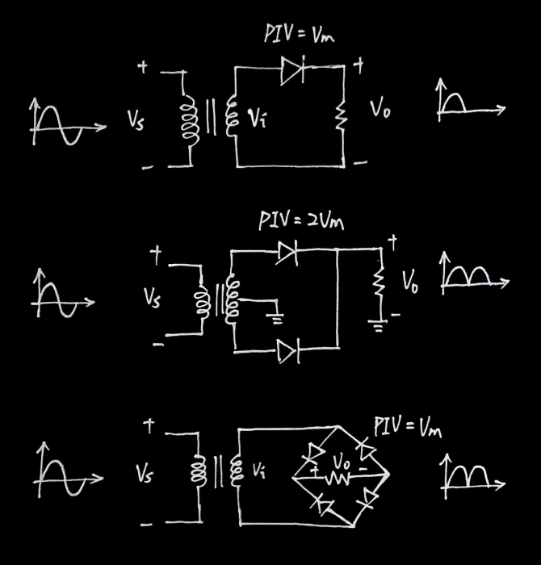

### 🔸 濾波電路

| | 半波整流 | 中間抽頭 | 橋式整流 |
|---|:-:|:-:|:-:|
| $PIV$ | $2V_{i(m)}$ | $2V_{i(m)}$ | $V_{i(m)}$ |
| $f_{o}$ | $f_{i}$ | $2f_{i}$ | $2f_{i}$ |
| $V_{r(p-p)}$ | $\frac{V_{o(dc)}}{R_{L} \times C \times f_{o}}$ | $\frac{V_{o(dc)}}{R_{L} \times C \times f_{o}}$ | $\frac{V_{o(dc)}}{R_{L} \times C \times f_{o}}$ |
| $V_{r(rms)}$ | $\frac{V_{o(dc)}}{2 \sqrt{3} \times R_{L} \times C \times f_{o}}$ | $\frac{V_{o(dc)}}{2 \sqrt{3} \times R_{L} \times C \times f_{o}}$ | $\frac{V_{o(dc)}}{2 \sqrt{3} \times R_{L} \times C \times f_{o}}$ |

$\underset{\color{Teal} \text{漣波有效值}}{V_{r(rms)}} = \sqrt{V_{rms}^{2} - V_{dc}^{2}}$

$\underset{\color{Teal} \text{漣波因數}}{r\%} = \frac{V_{r(rms)}}{V_{dc}} \;\; {\color{Teal} \text{(越小越好)}}$

$V_{o(dc)} = V_{o(m)} - V_{r(m)}$

$V_{r(m)} = \frac{V_{r(p-p)}}{2}$

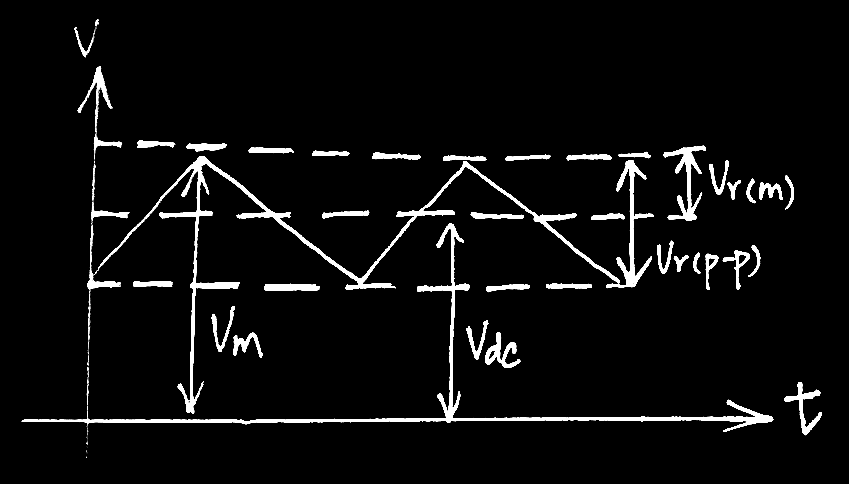

### 🔸 BJT

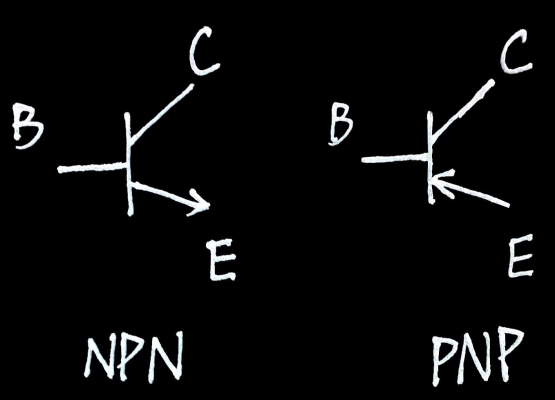

| 極性 | 描述 |
|---|---|
| E | 發射載子 |
| C | 控制載子流 |
| B | 收集載子 |

| 模式 | BE&CB 接面偏壓 | 功能 | 電流/電壓 |
|---|---|---|---|
| 順向主動區 | 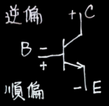 | 放大器 | $I_{C} = \beta I_{B}$ |
| 逆向主動區 | 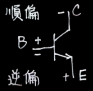 | 邏輯交換電路 | |
| 飽和區 | 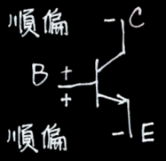 | 開關-ON | $I_{C} \leq \beta I_{B}, \; V_{CE} = 0.2V$ |
| 截止區 |  | 開關-OFF | $I_{C} = I_{B} = 0$ |

#### BJT 飽和條件

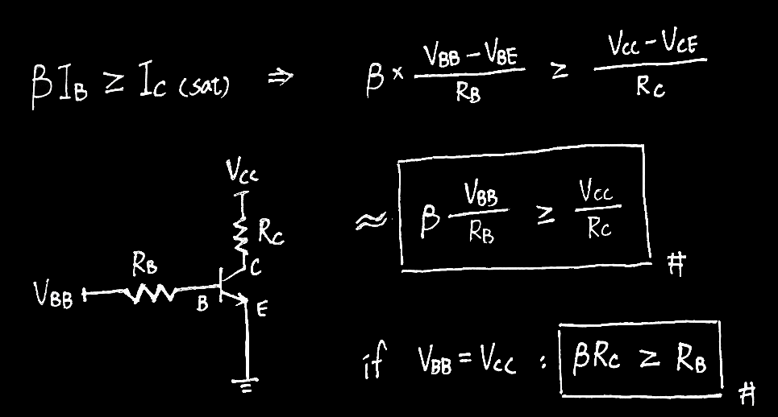

### 🔸 BJT 放大器

#### 組態腳位

| 組態 | 共接腳 | 輸入腳 | 輸出腳 | 電流增益 $\frac{I_{o}}{I_{i}}$ |
|---|:-:|:-:|:-:|:-:|
| CE | E | B | C | $\beta$ |
| CC | C | B | E | $\gamma$ |
| CB | B | E | C | $\alpha$ |

🔹 C 極不當輸入端、B 極不當輸出端

#### 組態比較

| | CE | CC | CB |
|---|:-:|:-:|:-:|
| 別稱 | | $\underset{\color{Teal} V_{o} \approx V_{i}}{\text{電壓緩衝器}}$ | $\underset{\color{Teal} I_{o} \approx I_{i}}{\text{電流緩衝器}}$ |
| | | | |
| $R_{i}$ | $\text{中}$ | $\text{大}$ | $\text{小}$ |
| $R_{o}$ | $\text{中}$ | $\text{小}$ | $\text{大}$ |
| | | | |
| $A_{v}$ | $\underset{\color{Teal} A_{v} > 1}{\text{中}}$ | $\underset{\color{Teal} A_{v} \approx 1}{\text{小}}$ | $\underset{\color{Teal} A_{v} > 1}{\text{大}}$ |
| $A_{i}$ | $\underset{\color{Teal} A_{i} > 1}{\text{中}}$ | $\underset{\color{Teal} A_{i} > 1}{\text{大}}$ | $\underset{\color{Teal} A_{i} \approx 1}{\text{小}}$ |
| $A_{p}$ | $\underset{\color{Teal} A_{v} > 1, \; A_{i} > 1}{\text{大}}$ | $\text{小}$ | $\text{中}$ |
| | | | |
| 頻寬 | $\text{小}$ | $\text{中}$ | $\text{大}$ |
| 相位 | 反 | 同 | 同 |

#### 輸入曲線 / 輸出曲線

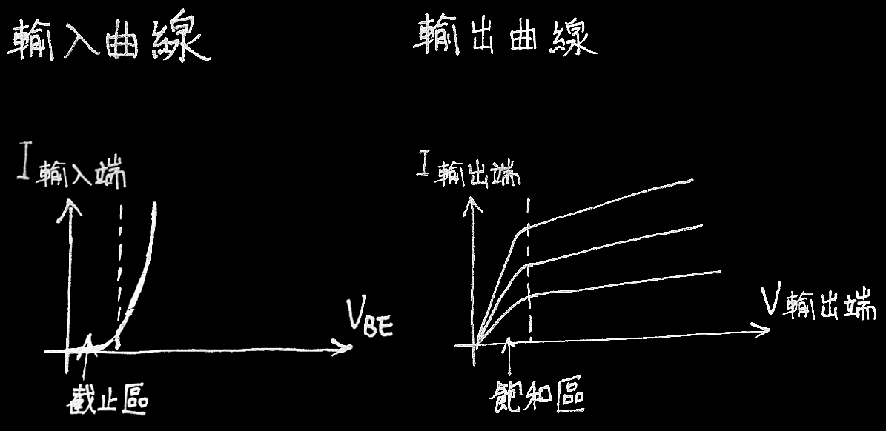

#### $R_{i}, \; R_{o}$

| 放大器 | $R_{i}$ | $R_{o}$ |
|---|:-:|:-:|
| 電壓放大器 | $\underset{\color{Teal} R_{i} >> R_{s}, \; R_{i} \text{上的分壓越大}}{\text{越大越好}}$ | $\underset{\color{Teal} R_{o} << R_{L}, \; R_{L} \text{上的分壓越大}}{\text{越小越好}}$ |
| 電流放大器 | $\underset{\color{Teal} R_{i} << R_{s}, \; R_{i} \text{上的分流越大}}{\text{越小越好}}$ | $\underset{\color{Teal} R_{o} >> R_{L}, \; R_{L} \text{上的分流越大}}{\text{越大越好}}$ |

#### 工作點

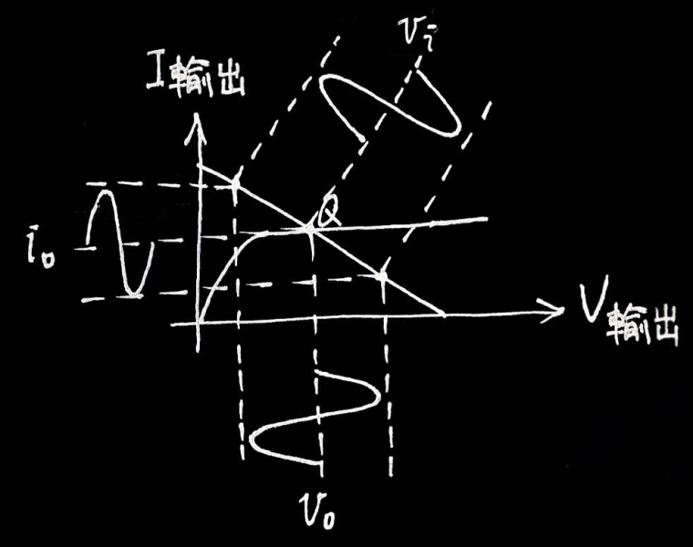

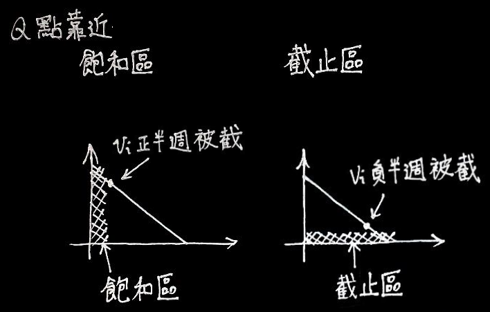

#### $\alpha , \; \beta$

| 增益 | 公式 | 範圍 |
|---|---|---|
| $\alpha$ | $\alpha = \frac{I_{C}}{I_{E}} = \frac{\beta}{1 + \beta}$ | $\alpha \leq 1$ |
| $\beta$ | $\beta = \frac{I_{C}}{I_{B}} = \frac{\alpha}{1 - \alpha}$ | |
| $\gamma$ | $\gamma  = \beta + 1$ | |

$I_{E} = I_{C} + I_{B}$

#### 增益

| 增益 | 公式 |
|---|---|
| 電壓增益 | $A_{v} = \frac{V_{o}}{V_{i}}$ |
| 電流增益 | $A_{i} = \frac{I_{o}}{I_{i}} = A_{v} \times \frac{R_{i}}{R_{o}}$ |
| 功率增益 | $A_{p} = A_{v} \times A_{i}$ |

$A_{v} = \frac{ \overset{\color{Teal} \alpha , \; \beta , \; \gamma}{\text{輸出對輸入電流比}} \; \times \; \text{輸出端看出去的等效電阻}}{\text{BJT輸入端看進去的等效電阻}}$

#### 米勒定理

### 🔸 BJT 串極放大

$A_{vT} = A_{v1} \times A_{v2} \times ... \times A_{vn}$

$A_{iT} = A_{i1} \times A_{i2} \times ... \times A_{in}$

$A_{pT} = A_{p1} \times A_{p2} \times ... \times A_{pn}$

#### 分貝增益 (dB)

$A_{v}(dB) = 20 \; logA_{v}$

$A_{i}(dB) = 20 \; logA_{i}$

$A_{p}(dB) = 10 \; logA_{p}$

$A_{vT}(dB) = A_{v1}(dB) + A_{v2}(dB) + ... + A_{vn}(dB)$

$A_{iT}(dB) = A_{i1}(dB) + A_{i2}(dB) + ... + A_{in}(dB)$

$A_{pT}(dB) = A_{p1}(dB) + A_{p2}(dB) + ... + A_{pn}(dB)$

#### 直接耦合

#### 疊接

#### 達靈頓

### 🔸 BJT 頻率響應

### 🔸 MOSFET

| | $\underset{\color{Teal} \text{增強型}}{E-MOSFET}$ | $\underset{\color{Teal} \text{空乏型}}{D-MOSFET}$ |
|---|:-:|:-:|
| $I_{D}$ | $k \times (V_{GS}-V_{GSt})^{2}$ | $I_{DSS} \times (1-\frac{V_{GS}}{V_GSp})^{2} \\ k \times (V_{GS}-V_{GSp})^{2} \\ k = \frac{I_{DSS}}{{V_{GSp}}^{2}}$ |
| 電流 | $I_{G} = 0, \; I_{S} = I_{D}$ | $I_{G} = 0, \; I_{S} = I_{D}$ |

***

基本電學

## 基本電學

### 🔸 色碼電阻

| 顏色 | 數值 | 倍數 | 誤差 |
|---|---|---|---|
| 

 黑 | $0$ | $10^{0}$ | |
| 

 棕 | $1$ | $10^{1}$ | $\pm 1 \%$ |
| 

 紅 | $2$ | $10^{2}$ | $\pm 2 \%$ |
| 

 橙 | $3$ | $10^{3}$ | |
| 

 黃 | $4$ | $10^{4}$ | |
| 

 綠 | $5$ | $10^{5}$ | $\pm 0.5 \%$ |
| 

 藍 | $6$ | $10^{6}$ | $\pm 0.25 \%$ |
| 

 紫 | $7$ | $10^{7}$ | $\pm 0.1 \%$ |
| 

 灰 | $8$ | $10^{8}$ | $\pm 0.05 \%$ |
| 

 白 | $9$ | $10^{9}$ | |
| | | | |
| 

 金 | | $10^{-1}$ | $\pm 5 \%$ |
| 

 銀 | | $10^{-2}$ | $\pm 10 \%$ |

